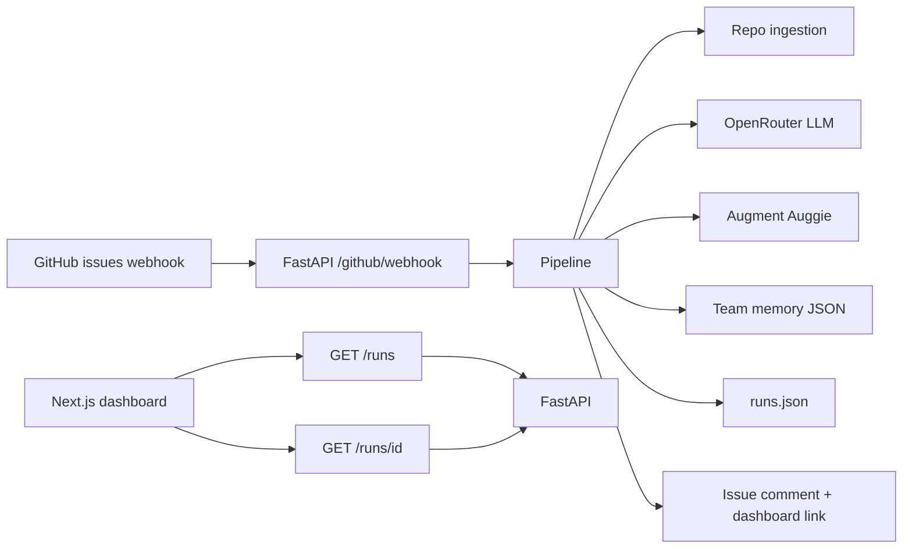

# Slope

<!-- SCREENSHOT (future): hero / landing — marketing-style capture of the home page (“Trace the path”) -->

Slope turns **assigned GitHub issues** into **onboarding maps** for engineers: prioritized files to read, warnings, a **Mermaid dependency graph**, and links back to a dashboard. It is built for a GitHub-centric workflow: you wire a repository webhook to the API; when someone is **assigned** to an issue, the backend ingests the repo, runs analysis (LLM + optional Augment relevance), recalls **team memory** from past runs, persists a **run record**, and posts a short issue comment that points at the full map in the web UI.

## Origins and goals

The idea started from a simple onboarding pain: a new engineer gets **assigned** a GitHub issue on a large repo and still has to guess **where to start**.

Design goals from early product notes:

- **GitHub-native trigger** — `issues` webhooks, keyed on `action=assigned`, with signature verification and idempotency (so duplicate deliveries do not spam the thread).
- **Multimodal tickets** — screenshots and diagrams in the issue body matter, not only title and description; analysis can use that visual context when images are available.
- **Two surfaces** — a **short issue comment** is the ping and deep link; the **dashboard** is where the full map, Mermaid graph, images, and memory live (no squeezing the whole UX into GitHub-flavored Markdown).
- **Compounding team memory** — lessons from past runs are recalled for similar areas and written back after a successful map, so warnings can get richer over time without hand-maintained docs.

## How it works

1. **GitHub** sends an `issues` webhook with `action=assigned` to `POST /github/webhook`. The handler verifies `X-Hub-Signature-256` (when `GITHUB_WEBHOOK_SECRET` is set), skips non-issue events and duplicate runs (via a marker in existing issue comments), then queues work in the background.
2. **Ingestion** clones or analyzes the repository (tree, README excerpt, code snippets) using the configured `GITHUB_PAT`.
3. **Ticket analysis** (OpenRouter) classifies the issue and suggests search terms; a small fallback exists if the LLM is unavailable.
4. **Augment (Auggie SDK)** optionally scores relevant files and dependency notes using your Augment session (see env vars below).
5. **Team memory** loads `backend/data/memory.json` (by default), recalls snippets for this repo, and after a successful map **appends** new learnings.
6. **Onboarding map** (OpenRouter) produces files-to-read, warnings, and Mermaid source. The run is saved to `backend/data/runs.json` (default). If a map was produced, the backend posts a GitHub issue comment with a dashboard link (`DASHBOARD_BASE_URL`).
7. **Dashboard** (Next.js) lists runs and shows each run’s markdown description, images from the issue, analysis tags, file list, warnings, memory snippets, and the rendered dependency graph.



## Repository layout

| Path | Role |
|------|------|
| `backend/` | FastAPI app (`app/main.py`), webhook + `/runs` API, pipeline, JSON stores under `backend/data/` |
| `frontend/` | Next.js 16 app: home, `/runs`, `/runs/[id]` |

## Prerequisites

- **Python 3.13+** and [**uv**](https://docs.astral.sh/uv/) (used to install and run the backend; lockfile: `backend/uv.lock`).
- **Node.js** (current stack uses Next 16 / React 19 — use a recent LTS).
- **GitHub** account with permission to create a Personal Access Token and configure a repo webhook.
- **OpenRouter** API key for ticket analysis and onboarding maps (see `backend/.env.example`).
- **Augment Auggie** CLI logged in on the machine that runs the backend, if you want the Augment relevance step (`auggie login`, then `auggie token print` → `AUGMENT_SESSION_AUTH`). The pipeline can still proceed if Augment fails or is omitted, with reduced file-level signal.

## Local setup

### 1. Backend

```bash
cd backend
cp .env.example .env
# Edit .env: at minimum GITHUB_PAT, GITHUB_WEBHOOK_SECRET, OPENROUTER_API_KEY,
# AUGMENT_SESSION_AUTH (recommended), CORS_ORIGINS, DASHBOARD_BASE_URL.
uv sync
uv run uvicorn app.main:app --reload --host 0.0.0.0 --port 8000
```

Sanity checks:

- [http://127.0.0.1:8000/health](http://127.0.0.1:8000/health) → `{"status":"ok"}`
- [http://127.0.0.1:8000/version](http://127.0.0.1:8000/version) → app version from `pyproject.toml`

Optional tests:

```bash
cd backend
uv run pytest
```

### 2. Frontend

```bash
cd frontend
cp .env.example .env.local
# Ensure NEXT_PUBLIC_API_BASE_URL matches the backend (no trailing slash), e.g.:
# NEXT_PUBLIC_API_BASE_URL=http://127.0.0.1:8000
npm install
npm run dev
```

Open [http://localhost:3000](http://localhost:3000). The **Runs** page calls the backend; if the API is down, the UI shows an error with the same hint about `NEXT_PUBLIC_API_BASE_URL`.

<!-- SCREENSHOT (future): runs list — cards with repo#issue and “Map ready” / “Partial” badges -->

<!-- SCREENSHOT (future): run detail — file list + Mermaid “Dependency map” section -->

### 3. CORS

The backend allows origins from `CORS_ORIGINS` (comma-separated). For local Next.js, `http://localhost:3000` matches the default in `backend/.env.example`.

## Environment variables (summary)

**Backend** (`backend/.env`) — full comments and optional keys: see [`backend/.env.example`](backend/.env.example).

| Variable | Purpose |
|----------|---------|
| `GITHUB_PAT` | Clone/read repo, issue comments, idempotency checks |
| `GITHUB_WEBHOOK_SECRET` | HMAC verification for incoming webhooks |
| `OPENROUTER_API_KEY` | Ticket analysis + onboarding map LLM calls |
| `AUGMENT_SESSION_AUTH` | Session JSON from `auggie token print` (recommended for Augment) |
| `CORS_ORIGINS` | Browser origins allowed to call the API |
| `DASHBOARD_BASE_URL` | Base URL embedded in GitHub issue comments (no trailing slash) |
| `MEMORY_STORE_PATH` | Optional override for team memory file (default `backend/data/memory.json`) |
| `RUNS_STORE_PATH` | Optional override for run history (default `backend/data/runs.json`) |

**Frontend** (`frontend/.env.local`):

| Variable | Purpose |
|----------|---------|
| `NEXT_PUBLIC_API_BASE_URL` | FastAPI base URL the browser uses for `/runs` |

## Connecting GitHub (webhook)

For **local development**, GitHub must reach your machine (e.g. [ngrok](https://ngrok.com/), Cloudflare Tunnel, or similar) unless you deploy the API to a public URL.

1. In the GitHub repo: **Settings → Webhooks → Add webhook**.
2. **Payload URL**: `https://<your-public-host>/github/webhook` (or `http://...` only for local tools that proxy HTTPS).
3. **Content type**: `application/json`.
4. **Secret**: same value as `GITHUB_WEBHOOK_SECRET` in `backend/.env`.
5. **Events**: choose **Let me select individual events** and enable **Issues** (the app listens for the `issues` event).
6. Save and confirm deliveries show `202 Accepted` for assigned issues (or `200` when intentionally skipped).

Trigger a run by **assigning** an issue in that repository (not merely opening or labeling). The first successful map also triggers a **comment** on the issue with a link to `/runs/<id>` on your dashboard.

<!-- IMAGE (future): diagram or screenshot of GitHub webhook settings (payload URL + Issues event) -->

## Data on disk

Under `backend/data/`, JSON files hold **team memory** and **run history**. The directory is tracked in git but its contents are ignored (see `backend/data/.gitignore`). Do not commit secrets; keep `.env` out of version control (root `.gitignore` includes `.env`).

## Troubleshooting

- **Runs page shows “API unreachable”** — Start the backend and align `NEXT_PUBLIC_API_BASE_URL` with the host/port where uvicorn listens.
- **Webhook returns 503** — Set `GITHUB_WEBHOOK_SECRET` and `GITHUB_PAT` in `backend/.env`.
- **401 on webhook** — Secret mismatch between GitHub webhook configuration and `GITHUB_WEBHOOK_SECRET`.
- **Pipeline logs** — Watch the terminal running uvicorn; loggers use the `slope.*` namespace (e.g. `slope.pipeline`, `slope.github.webhook`).

## License / contributing

Add your preferred license and contribution guidelines here if the project is open source.
